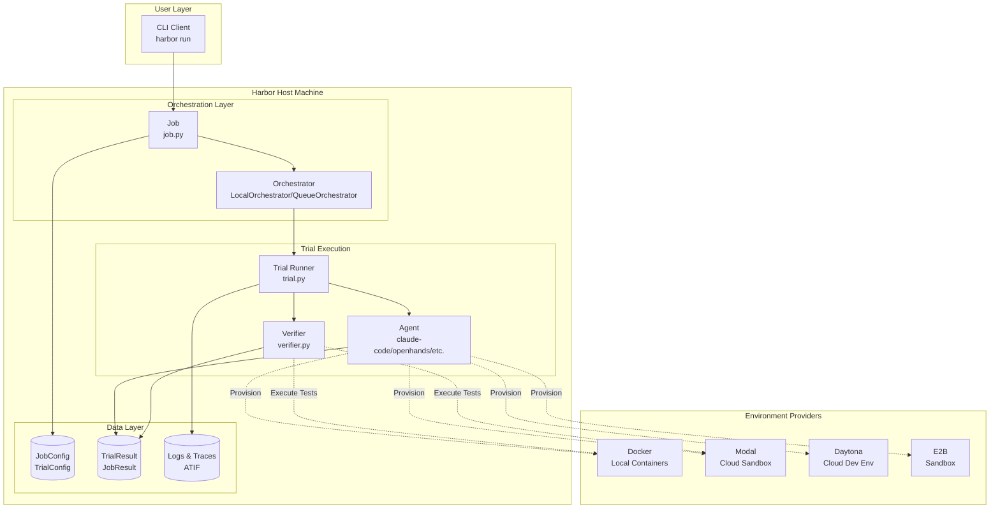
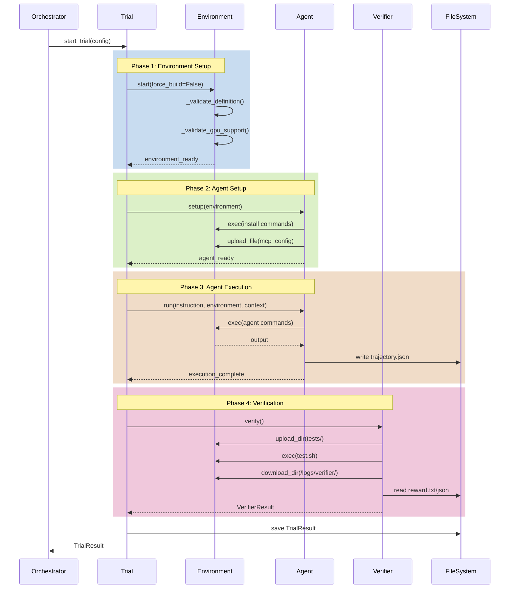
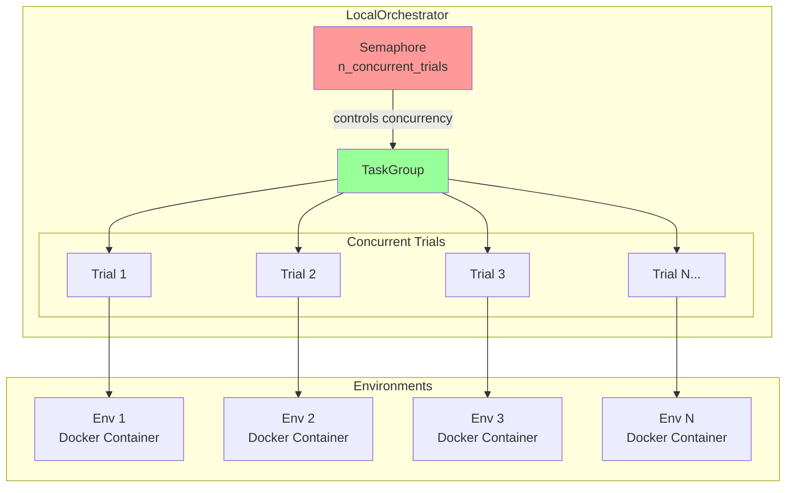
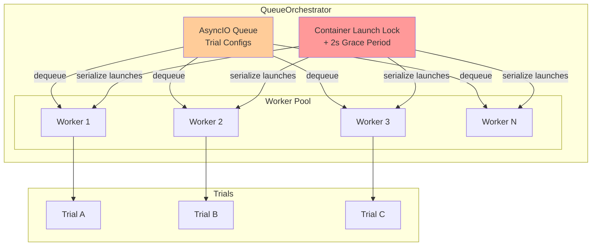
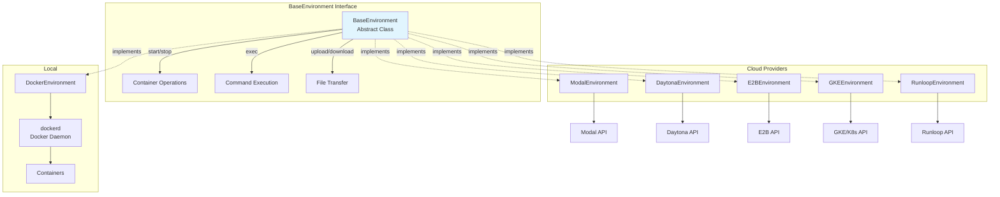
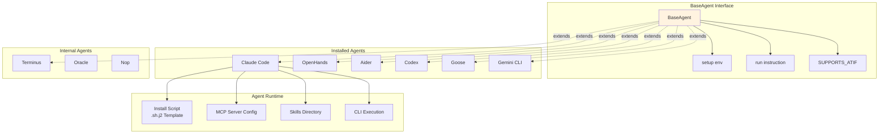
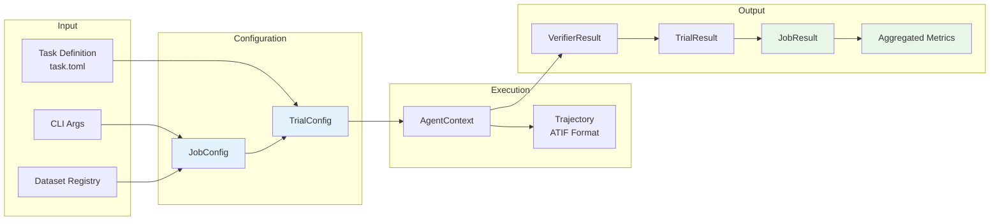
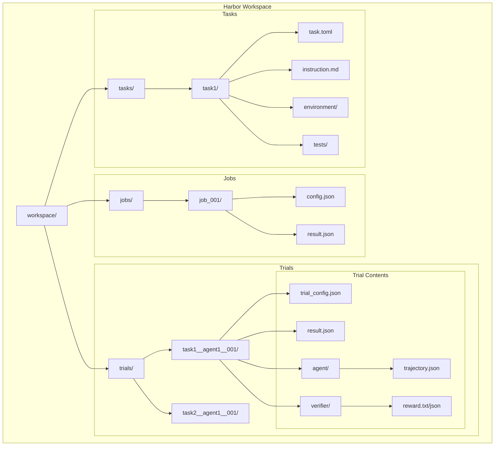
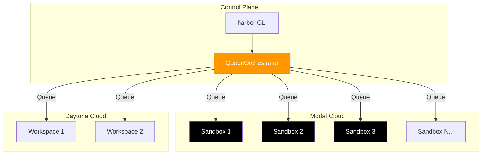
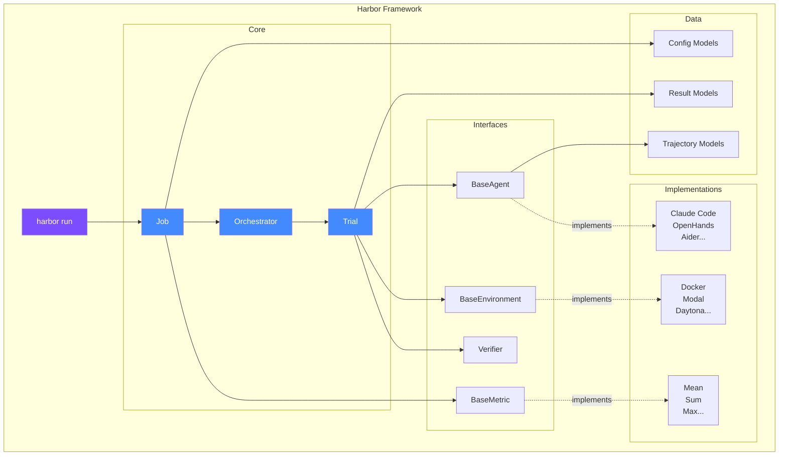

# Harbor 运行态部署架构图

> 基于Harbor源码分析的运行时架构可视化

---

## 1. 整体运行态架构



---

## 2. 单个Trial执行流程



---

## 3. 并行执行架构 (LocalOrchestrator)



---

## 4. 并行执行架构 (QueueOrchestrator)



---

## 5. 环境提供者架构



---

## 6. Agent执行架构



---

## 7. 验证器架构

```mermaid
graph TB
    subgraph "Verifier Flow"
        V[Verifier]
        UPLOAD[Upload tests/]
        EXEC[Execute test.sh]
        DOWNLOAD[Download /logs/verifier/]
        PARSE[Parse Reward]
    end

    subgraph "Environment"
        ENV[Container/Sandbox]
        TESTDIR[/tests/]
        SCRIPT[test.sh]
        REWARD[/logs/verifier/]
    end

    subgraph "Output"
        TXT[reward.txt<br/>0.85]
        JSON[reward.json<br/>{accuracy: 0.85}]
        STDOUT[test-stdout.txt]
    end

    V --> UPLOAD
    UPLOAD --> TESTDIR
    TESTDIR --> SCRIPT
    SCRIPT --> EXEC
    EXEC --> REWARD
    REWARD --> DOWNLOAD
    DOWNLOAD --> PARSE
    PARSE --> TXT
    PARSE --> JSON
    PARSE --> STDOUT

    style V fill:#e8f5e9
    style REWARD fill:#fff8e1
```

---

## 8. 数据流架构



---

## 9. 目录结构映射



---

## 10. 典型部署场景

### 场景A: 本地开发测试

```mermaid
graph TB
    subgraph "Developer Machine"
        CLI[harbor CLI]
        ORCH[LocalOrchestrator]
        DOCKER[Docker Desktop]

        subgraph "Containers"
            C1[Task Container 1]
            C2[Task Container 2]
            C3[Task Container 3]
            C4[Task Container 4]
        end
    end

    CLI --> ORCH
    ORCH -->|Semaphore(4)| DOCKER
    DOCKER --> C1
    DOCKER --> C2
    DOCKER --> C3
    DOCKER --> C4

    style DOCKER fill:#2496ed,color:white
```

### 场景B: 大规模云端评估



---

## 11. 关键组件交互图



---

## 总结

| 组件 | 职责 | 可扩展点 |
|------|------|----------|
| **CLI** | 命令解析、入口 | 自定义命令 |
| **Job** | 配置管理、结果聚合 | JobConfig扩展 |
| **Orchestrator** | 并行调度 | 新调度策略 |
| **Trial** | 单次执行编排 | Hook机制 |
| **Agent** | 任务执行 | 新Agent实现 |
| **Environment** | 容器/沙箱管理 | 新环境提供者 |
| **Verifier** | 结果验证 | 自定义测试脚本 |
| **Metrics** | 指标聚合 | 新Metric类型 |
